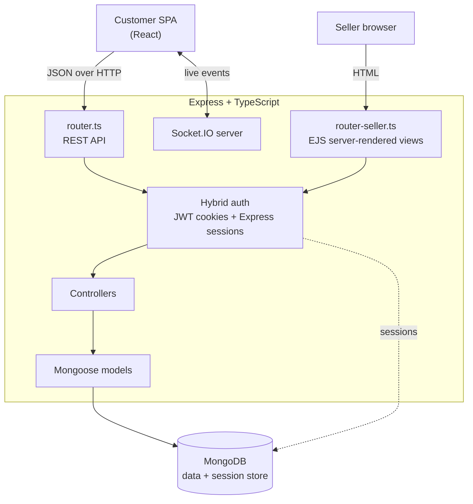

# Fenzo — Marketplace Backend

**Multi-vendor e-commerce backend in TypeScript.** A hybrid Express server that exposes a REST API to the customer SPA and serves a server-rendered dashboard to sellers from the same process — two delivery models over one domain layer.


> Customer client: **[Fenzo-frontend](https://github.com/myx-codes/Fenzo-frontend)**

---

## About this project

Fenzo is a personal project built to work through a design question rather than to ship a product: when one application has two audiences with different needs, does it have to be two applications?

Customers need a fast, stateful, app-like experience — that argues for a SPA over a REST API. Sellers need form-heavy administrative screens that must work reliably, load fast on a cold visit, and be indexable — that argues for server-side rendering. Fenzo does both from a single Express process, with two routers over a shared model and controller layer.

It has not served production traffic. Everything below describes what is implemented in this repository.

---

## Architecture



### Two routers, one domain

| Router | Audience | Delivery |
|---|---|---|
| `router.ts` | Customer SPA | JSON REST endpoints |
| `router-seller.ts` | Sellers | EJS-rendered pages with progressive AJAX updates |

Both call the same controllers and models, so business rules — stock, pricing, order state transitions — are defined once and cannot diverge between the two surfaces.

### Hybrid authentication

The two audiences authenticate differently because their constraints differ. The SPA uses JWTs in HTTP-only cookies, which suits a client that manages its own navigation. The server-rendered seller panel uses Express sessions persisted in MongoDB via `connect-mongodb-session`, which survives server restarts and keeps sellers logged in across deploys. Google OAuth is wired in through `google-auth-library` as an additional sign-in path.

---

## Features

**Catalogue and search.** Product listings with category, price-range, and keyword filtering, including parsing of natural-language style queries into structured filters.

**Recommendations.** A rule-based engine that ranks products using browsing signals, category affinity, and product relevance to improve discovery across the catalogue.

**Orders.** Cart to checkout to order lifecycle, with state transitions from pending through delivered or cancelled, and per-seller order visibility.

**Seller dashboard.** Server-rendered views for store performance, customer management, inventory control, and order handling, updated through AJAX calls against the same controllers.

**Media handling.** Image uploads via `multer`, written to a static uploads directory served by the app.

**Real-time.** A Socket.IO server for live events between customers and sellers.

**SEO.** Server-rendered seller and catalogue pages carry meta tags for indexing — one of the reasons the seller surface is rendered on the server rather than in the client.

---

## Tech stack

| Layer | Technologies |
|---|---|
| Runtime | Node.js, TypeScript 5.2 |
| Framework | Express 4 |
| Views | EJS |
| Database | MongoDB, Mongoose 6 |
| Auth | jsonwebtoken, express-session, connect-mongodb-session, bcryptjs, google-auth-library |
| Uploads | multer |
| Real-time | Socket.IO 4.8 |
| Validation | validator |
| Logging | morgan |
| Deployment | Docker, Nginx reverse proxy, Cloudflare |

---

## Getting started

### Prerequisites

- Node.js 20+
- MongoDB (local or Atlas)

### Setup

```bash
git clone https://github.com/myx-codes/Fenzo-backend.git
cd Fenzo-backend
npm install
```

Create `.env` in the project root:

| Variable | Description |
|---|---|
| `PORT` | HTTP port |
| `MONGO_URL` | MongoDB connection string |
| `SECRET_TOKEN` | JWT signing secret |
| `SESSION_SECRET` | Express session secret |
| `GOOGLE_CLIENT_ID` | Google OAuth client ID |

### Run

```bash
npm run start:dev     # nodemon + ts-node
npm run build         # tsc
npm run start:prod    # node dist/server.js
```

---

## Repository layout

```
src/
  controllers/    request handlers for both routers
  models/         business logic over Mongoose
  schema/         Mongoose schemas
  libs/           shared types, enums, config, utilities
  views/          EJS templates for the seller dashboard
  public/         static assets for server-rendered pages
  router.ts       customer REST API routes
  router-seller.ts  seller dashboard routes
  app.ts          Express application setup
  server.ts       HTTP and Socket.IO bootstrap
```

---

## Author

**Mukhammadyusuf Kholbajonov** — Backend / Full-Stack Engineer
MSc Computer Engineering, Dongguk University, Seoul
[GitHub](https://github.com/myx-codes)
